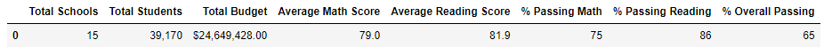
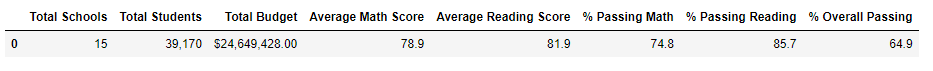
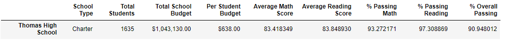
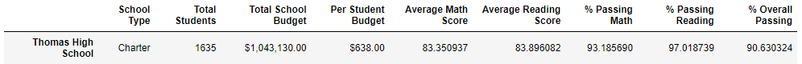
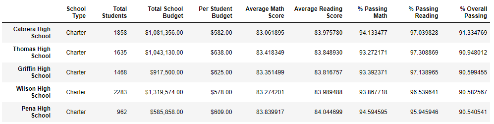
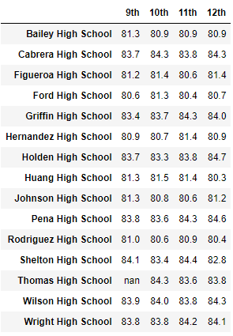
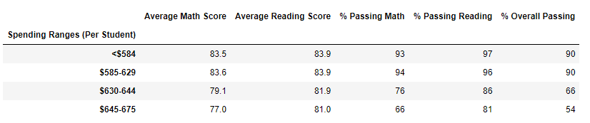
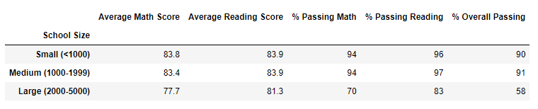
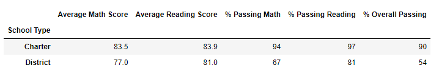

# School-District-Analysis
### Submission by Omar Zu'bi

## Project Overview
Evidence of academic dishonesty in testing scores were found for Thomas High School 9th grade students and has prompted a analysis of the reassessed scores. The math and reading scores for Thomas High School 9th grader's were replaced with NaNs while keeping the rest of the school's data intact. A school district analysis was conducted once again and a writeup describing how these changes affected the overall analysis are provided in the report. 

## Resources Included in Repository
Software:
* Python 3.7.10
* Jupyter Notebook

Files Included sources: 
* [school_complete.csv](Resources/school_complete.csv) 
* [students_complete.csv](Resources/students_complete.csv)

## Results

* How is the district summary affected?
The reassessment has proven that Thomas High School performance in all averages (math, reading, and overall) has decreased by a small margin (0.1% - 0.3%). This indicates that the ninth-grade scores of Thomas High School were close to the school's average, and by removing the compromised scores, had minimal effect on the school's overall performance.

Original:
 

Reassessed: 
 

* How is the school summary affected?
After the removal of the compromised scores, only small margins of changes can be observed:

Original:
 

Reassessed: 
 

* How does replacing the ninth grader's math and reading scores affect Thomas High Shcool's performance relative to the other schools?
After replacing the ninth grader's math and reading scores, Thomas High School still ranks second for highest overall passing percent rate. 

Original:
 

Reassessed:
 

* How does replacing the ninth-grade scores affect the following:
The images provided below show the effect of the changes made to the data. 

  1) Math and reading scores by grade?
 
   
 
  2) Scores by school spending?
  
   
  
  3) Scores by school size?
  
   
  
  4) Scores by school type?
 
   
 
 
## Summary
The reassessment of the reading and math scores for the ninth graders at Thomas High School has shown that the overall performance of the school has decreased, but only by a small margin!
* the average math score dropped by 0.07
* percent of students who passed math reduced by 0.09%
* percent of students who passed reading reduced by 0.29%
* percent of students who passed both math and reading reduced by 0.31%

